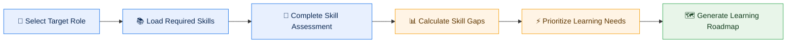
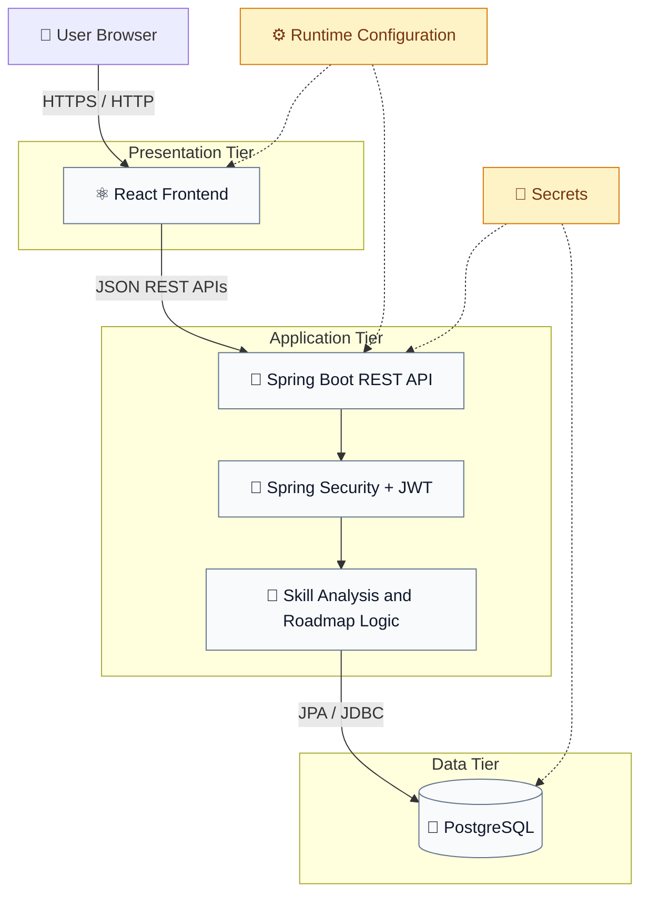
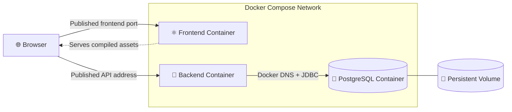
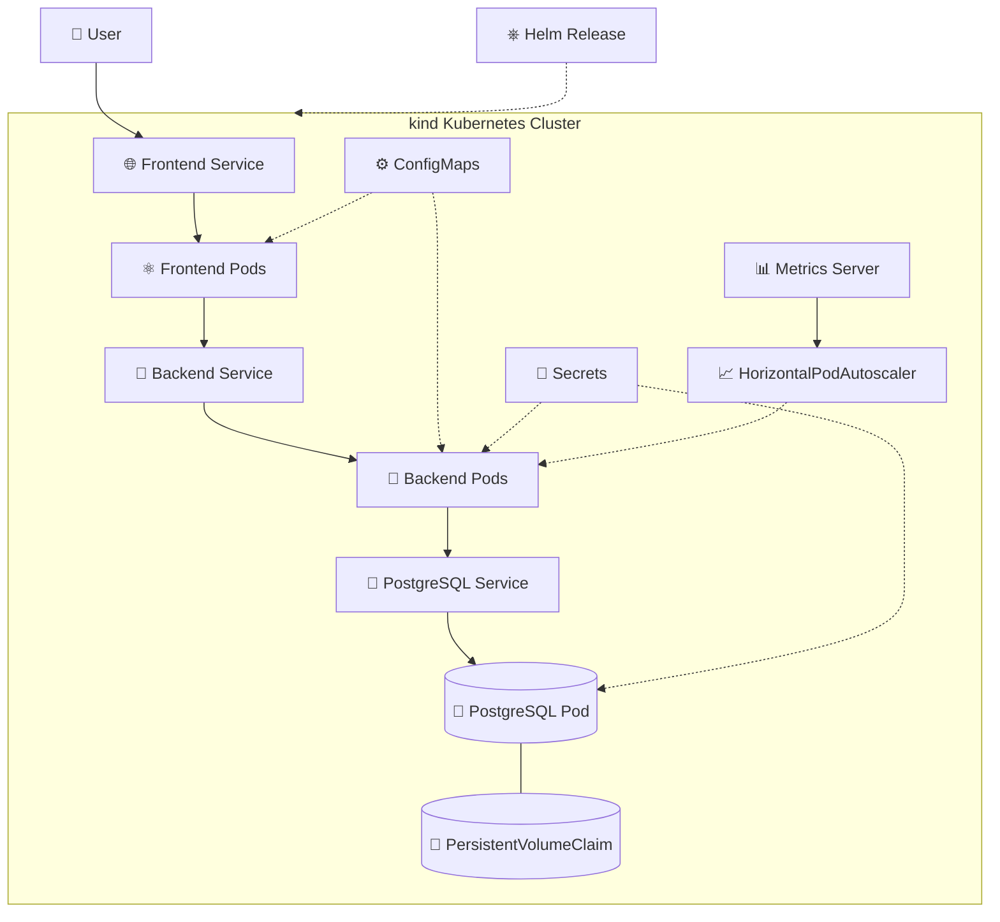
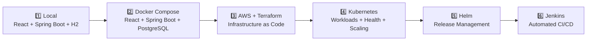

<div align="center">

# ⚡ SkillOrbit

### Cloud-Native Career Intelligence Platform

**Turn career goals into measurable skill gaps and structured learning roadmaps.**

[](https://react.dev/)
[](https://spring.io/projects/spring-boot)
[](https://www.postgresql.org/)
[](https://www.docker.com/)
[](https://kubernetes.io/)
[](https://www.terraform.io/)
[](https://www.jenkins.io/)
[](https://helm.sh/)

</div>

---

## 🌟 Overview

**SkillOrbit** is a cloud-native three-tier career intelligence platform that helps users assess current proficiency, identify gaps against a target role, and generate prioritized learning roadmaps.

Beyond the application itself, SkillOrbit demonstrates an end-to-end engineering journey:

```text
Local Development → Docker Compose → AWS + Terraform → Kubernetes → Helm → Jenkins CI/CD
```

The project keeps application compilation, runtime image packaging, infrastructure provisioning, and deployment as distinct concerns. This makes every stage easier to validate, troubleshoot, and evolve.

## ✨ What SkillOrbit Does

### 👤 User Experience

- Register and sign in securely
- Select a target career role
- Review role-specific skill requirements
- Submit current proficiency levels
- Run skill-gap analysis
- Receive prioritized learning recommendations

### 🛡️ Administrator Experience

- Manage users
- Create, update, and remove career roles
- Create, update, and remove skills
- Associate required skills with target roles
- Configure learning-roadmap data through the application

### 🔐 Security Model

- JWT-based authentication
- Spring Security
- Role-based access control
- Backend-enforced authorization for administrator and user operations

## 🧭 Core Product Workflow



## 🏗️ Application Architecture

SkillOrbit uses a realistic three-tier architecture with configuration and secrets externalized from the application images.



> H2 is used for the original local-development phase. PostgreSQL is the runtime database for containerized and orchestrated deployments.

## 🐳 Containerized Architecture



Key design points:

- Containers communicate through Docker service discovery.
- Browser traffic uses host-reachable addresses.
- PostgreSQL data is stored independently of the container lifecycle.
- Environment-specific values remain outside the built images.

## ☸️ Kubernetes and Helm Architecture



The Kubernetes deployment includes:

- Deployments and Services
- ConfigMaps and Secrets
- Startup, readiness, and liveness probes
- CPU and memory requests and limits
- Metrics Server
- Horizontal Pod Autoscaler
- Persistent PostgreSQL storage
- Helm-based release packaging

## 🚀 CI/CD Delivery Architecture

```mermaid
flowchart LR
    Git[💻 Source Commit] --> Jenkins[🔧 Jenkins Pipeline]
    Jenkins --> BackendBuild[☕ Build and Test Backend]
    Jenkins --> FrontendBuild[⚛️ Build Frontend Assets]
    BackendBuild --> Images[🐳 Build Runtime Images]
    FrontendBuild --> Images
    Images --> Scan[🛡️ Trivy Scan]
    Scan --> Registry[📦 Push Versioned Images to GHCR]
    Registry --> Credentials[🔑 Reconcile Pull Credentials]
    Credentials --> Helm[⎈ Helm Upgrade or Install]
    Helm --> Rollout[☸️ Validate Kubernetes Rollout]
    Rollout --> Result{Deployment Healthy?}
    Result -->|Yes| Success[✅ Release Complete]
    Result -->|No| Failure[❌ Pipeline Fails]

    classDef success fill:#dcfce7,stroke:#16a34a,color:#14532d
    classDef failure fill:#fee2e2,stroke:#dc2626,color:#7f1d1d
    class Success success
    class Failure failure
```



The delivery model follows a **build once, package once, deploy predictably** approach:

1. Jenkins checks out the source.
2. Maven builds and tests the Spring Boot artifact.
3. npm builds the React production assets.
4. Runtime Docker images consume the prebuilt artifacts.
5. Trivy scans the images.
6. Versioned images are published to GHCR.
7. Kubernetes image-pull credentials are reconciled.
8. Helm performs the release upgrade or installation.
9. Kubernetes rollout status determines the final pipeline result.

## 🧰 Technology Stack

| Area | Technologies |
|---|---|
| 🎨 Frontend | React, JavaScript, HTML, CSS |
| ⚙️ Backend | Java, Spring Boot, Spring Security, Spring Data JPA, REST APIs |
| 🗄️ Data | H2 for the original local phase, PostgreSQL for containerized and orchestrated deployments |
| 🐳 Containers | Docker, Docker Compose, runtime-focused Docker images |
| ☁️ Cloud and IaC | AWS, Terraform, S3 remote state, DynamoDB state locking |
| ☸️ Orchestration | Kubernetes, kind, Helm, ConfigMaps, Secrets, probes, Metrics Server, HPA |
| 🔄 CI/CD | Jenkins, GitHub Actions, Git, GitHub, GitLab synchronization |
| 🛡️ Security | JWT, RBAC, Trivy, least-privilege credentials, externalized secrets |
| 📦 Registry | GitHub Container Registry |

## 📈 Deployment Evolution



| Phase | Deployment model | Documentation |
|---|---|---|
| 1️⃣ | Traditional local deployment | [Traditional deployment](docs/Deployment-Strategies/01-traditional-deployment.md) |
| 2️⃣ | Docker Compose deployment | [Containerized deployment](docs/Deployment-Strategies/02-containerized-deployment.md) |
| 3️⃣ | AWS infrastructure with Terraform | [AWS cloud deployment](docs/Deployment-Strategies/03-cloud-deployment.md) |
| 4️⃣ | Kubernetes orchestration on kind | [Kubernetes deployment](docs/Deployment-Strategies/04-orchestrated-cloud-deployment.md) |
| 5️⃣ | Helm-managed Kubernetes release | [Helm release management](docs/Engineering-Journal/05-helm-release-management.md) |
| 6️⃣ | Jenkins-automated delivery | [Jenkins CI/CD automation](docs/Engineering-Journal/06-jenkins-cicd-automation.md) |

## 🏷️ Release Milestones

| Release | Milestone |
|---|---|
| `v1.2.2` | Manual Kubernetes deployment |
| `v1.2.3` | Helm-managed Kubernetes deployment |
| `v1.3.0` | Jenkins-integrated CI/CD deployment |

## 📚 Documentation Hub

<details>
<summary><strong>🧩 Technical Documentation</strong></summary>

- [API documentation](docs/Technical-Documentation/api-docs.md)
- [Setup guide](docs/Technical-Documentation/setup-guide.md)
- [Engineering plan](docs/Technical-Documentation/sprint-plan.md)

</details>

<details>
<summary><strong>🐳 Containerization</strong></summary>

- [Containerization overview](docs/Containerization/README.md)
- [Container architecture](docs/Containerization/01-container-architecture.md)
- [Docker images](docs/Containerization/02-docker-images.md)
- [Docker Compose deployment](docs/Containerization/03-docker-compose-deployment.md)
- [Networking and configuration](docs/Containerization/04-networking-and-configuration.md)
- [Troubleshooting](docs/Containerization/05-troubleshooting.md)

</details>

<details>
<summary><strong>🚀 Deployment Strategies</strong></summary>

- [Traditional local deployment](docs/Deployment-Strategies/01-traditional-deployment.md)
- [Containerized deployment](docs/Deployment-Strategies/02-containerized-deployment.md)
- [AWS cloud deployment](docs/Deployment-Strategies/03-cloud-deployment.md)
- [Kubernetes-orchestrated deployment](docs/Deployment-Strategies/04-orchestrated-cloud-deployment.md)

</details>

<details>
<summary><strong>🧪 Engineering Journal</strong></summary>

- [Engineering journal overview](docs/Engineering-Journal/README.md)
- [Application foundation](docs/Engineering-Journal/01-application-foundation.md)
- [Docker Compose evolution](docs/Engineering-Journal/02-docker-compose-evolution.md)
- [AWS and Terraform evolution](docs/Engineering-Journal/03-aws-terraform-evolution.md)
- [Kubernetes evolution](docs/Engineering-Journal/04-kubernetes-evolution.md)
- [Helm release management](docs/Engineering-Journal/05-helm-release-management.md)
- [Jenkins CI/CD automation](docs/Engineering-Journal/06-jenkins-cicd-automation.md)

</details>

## 🏁 Quick Start

### Prerequisites

- Java 17 or later
- Maven 3.9 or later, or the included Maven wrapper
- Node.js and npm
- Git
- Docker and Docker Compose for the containerized deployment

### Run Locally

Start the backend:

```bash
cd user-service
./mvnw spring-boot:run
```

If the Maven wrapper is unavailable:

```bash
mvn spring-boot:run
```

Open a second terminal and start the frontend:

```bash
cd skillorbit-ui
npm install
npm start
```

### Local Addresses

| Component | Address |
|---|---|
| ⚛️ Frontend | `http://localhost:3000` |
| 🍃 Backend | `http://localhost:8080` |
| 🗄️ H2 console | `http://localhost:8080/h2-console` when enabled by the active local configuration |

## 🐳 Run with Docker Compose

From the directory containing `docker-compose.yml`:

```bash
docker compose up --build -d
docker compose ps
docker compose logs -f
```

Stop the stack while retaining named volumes:

```bash
docker compose down
```

Remove the stack and its named volumes:

```bash
docker compose down -v
```

> [!WARNING]
> Removing named volumes deletes PostgreSQL data managed by the Compose project.

## ✅ Validation Flow

### Administrator

1. Sign in with an administrator account.
2. Create or update roles and skills.
3. Associate skills with a target role.
4. Configure learning-roadmap data.
5. Validate user and access management.

### User

1. Register or sign in.
2. Select a target role.
3. Load the required skills.
4. Submit current proficiency levels.
5. Run the skill-gap analysis.
6. Review prioritized learning recommendations.

## 🔒 Security Notes

- Never commit real `.env` files, passwords, AWS credentials, JWT secrets, registry tokens, or Kubernetes Secret values.
- Commit sanitized example configuration only.
- Enforce authorization in the backend rather than relying on frontend visibility.
- Use immutable, traceable image tags for releases.
- Review destructive commands before running them.

## 📌 Project Status

SkillOrbit currently demonstrates:

- ✅ Local application development
- ✅ Docker Compose containerization
- ✅ Terraform-managed AWS infrastructure
- ✅ Kubernetes deployment on kind
- ✅ Helm-based release packaging
- ✅ Trivy image scanning
- ✅ GHCR image publishing
- ✅ Jenkins-driven deployment and rollout validation

## 🛣️ Future Enhancements

- Centralized application logging
- Enhanced metrics and alerting
- External secret management
- Managed Kubernetes deployment
- Automated integration and end-to-end tests
- Policy checks for infrastructure and Kubernetes manifests
- Progressive delivery strategies

## 👨‍💻 Author

**Sadiq Pasha Shaik**  
Cloud Applications Consultant

---

<div align="center">

Built as a practical showcase of application engineering, infrastructure as code, containerization, Kubernetes operations, release management, and CI/CD automation.

⭐ If SkillOrbit is useful, consider starring the repository.

</div>