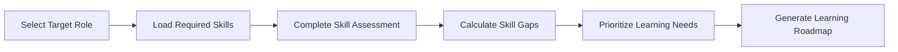
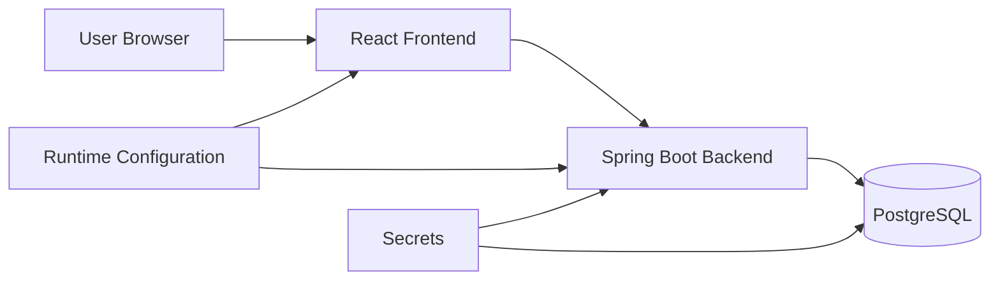
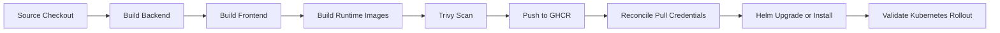

# ⚡ SkillOrbit

SkillOrbit is a cloud-native three-tier career intelligence platform that helps users identify skill gaps for a target role and generate personalized learning roadmaps.

The application combines a React frontend, Spring Boot backend, and PostgreSQL database with a practical DevOps journey across Docker Compose, AWS infrastructure, Kubernetes, Helm, and Jenkins.

## Core Workflow



## Features

### Authentication and Authorization

- User registration and login
- JWT-based authentication
- Spring Security
- Role-based access control for administrator and user capabilities

### Administrator Experience

- Manage users
- Create, update, and remove career roles
- Create, update, and remove skills
- Associate skills with target roles
- Configure learning-roadmap data through the application

### User Experience

- Select a target role
- Review role-specific skill requirements
- Submit current proficiency levels
- Run skill-gap analysis
- Review prioritized learning recommendations

## Technology Stack

| Layer | Technology |
|---|---|
| Frontend | React, JavaScript, HTML, CSS |
| Backend | Java, Spring Boot, Spring Security, Spring Data JPA, REST APIs |
| Database | H2 for the original local phase; PostgreSQL for containerized and orchestrated deployments |
| Containers | Docker, Docker Compose |
| Cloud and IaC | AWS, Terraform, S3 remote state, DynamoDB state locking |
| Orchestration | Kubernetes, kind, Helm, Metrics Server, Horizontal Pod Autoscaler |
| CI/CD and Security | Jenkins, GitHub Actions, GHCR, Trivy |

## Application Architecture



## Deployment Evolution

| Phase | Deployment model | Documentation |
|---|---|---|
| 1 | Traditional local deployment | [Traditional deployment](docs/Deployment-Strategies/01-traditional-deployment.md) |
| 2 | Docker Compose deployment | [Containerized deployment](docs/Deployment-Strategies/02-containerized-deployment.md) |
| 3 | AWS infrastructure with Terraform | [AWS cloud deployment](docs/Deployment-Strategies/03-cloud-deployment.md) |
| 4 | Kubernetes orchestration | [Kubernetes deployment](docs/Deployment-Strategies/04-orchestrated-cloud-deployment.md) |
| 5 | Helm-managed Kubernetes release | [Helm release management](docs/Engineering-Journal/05-helm-release-management.md) |
| 6 | Jenkins-automated delivery | [Jenkins CI/CD automation](docs/Engineering-Journal/06-jenkins-cicd-automation.md) |

## Release Milestones

| Release | Milestone |
|---|---|
| `v1.2.2` | Manual Kubernetes deployment |
| `v1.2.3` | Helm-managed Kubernetes deployment |
| `v1.3.0` | Jenkins-integrated CI/CD deployment |

## CI/CD Delivery Flow



The delivery model separates application compilation, runtime image packaging, and deployment. Jenkins builds the backend and frontend artifacts before the runtime images consume them.

## Documentation

### Technical Documentation

- [API documentation](docs/Technical-Documentation/api-docs.md)
- [Setup guide](docs/Technical-Documentation/setup-guide.md)
- [Engineering plan](docs/Technical-Documentation/sprint-plan.md)

### Containerization

- [Containerization overview](docs/Containerization/README.md)
- [Container architecture](docs/Containerization/01-container-architecture.md)
- [Docker images](docs/Containerization/02-docker-images.md)
- [Docker Compose deployment](docs/Containerization/03-docker-compose-deployment.md)
- [Networking and configuration](docs/Containerization/04-networking-and-configuration.md)
- [Troubleshooting](docs/Containerization/05-troubleshooting.md)

### Deployment Strategies

- [Traditional local deployment](docs/Deployment-Strategies/01-traditional-deployment.md)
- [Containerized deployment](docs/Deployment-Strategies/02-containerized-deployment.md)
- [AWS cloud deployment](docs/Deployment-Strategies/03-cloud-deployment.md)
- [Kubernetes-orchestrated deployment](docs/Deployment-Strategies/04-orchestrated-cloud-deployment.md)

### Engineering Journal

- [Engineering journal overview](docs/Engineering-Journal/README.md)
- [Application foundation](docs/Engineering-Journal/01-application-foundation.md)
- [Docker Compose evolution](docs/Engineering-Journal/02-docker-compose-evolution.md)
- [AWS and Terraform evolution](docs/Engineering-Journal/03-aws-terraform-evolution.md)
- [Kubernetes evolution](docs/Engineering-Journal/04-kubernetes-evolution.md)
- [Helm release management](docs/Engineering-Journal/05-helm-release-management.md)
- [Jenkins CI/CD automation](docs/Engineering-Journal/06-jenkins-cicd-automation.md)

## Local Development

### Prerequisites

- Java 17 or later
- Maven 3.9 or later, or the included Maven wrapper
- Node.js and npm
- Git

### Start the Backend

```bash
cd user-service
./mvnw spring-boot:run
```

If the Maven wrapper is unavailable:

```bash
mvn spring-boot:run
```

### Start the Frontend

Open a second terminal:

```bash
cd skillorbit-ui
npm install
npm start
```

### Local Addresses

| Component | Address |
|---|---|
| Frontend | `http://localhost:3000` |
| Backend | `http://localhost:8080` |
| H2 console | `http://localhost:8080/h2-console` when enabled by the active local configuration |

## Docker Compose

From the directory containing `docker-compose.yml`:

```bash
docker compose up --build -d
docker compose ps
docker compose logs -f
```

Stop the stack while retaining named volumes:

```bash
docker compose down
```

Remove the stack and named volumes:

```bash
docker compose down -v
```

> **Warning:** Removing volumes deletes PostgreSQL data managed by the Compose project.

## Validation Flow

### Administrator

1. Log in with an administrator account.
2. Create or update roles and skills.
3. Associate skills with a target role.
4. Configure learning-roadmap data.
5. Validate user and access management.

### User

1. Register or log in.
2. Select a target role.
3. Load the required skills.
4. Submit proficiency levels.
5. Run the skill-gap analysis.
6. Review prioritized learning recommendations.

## Security Notes

- Do not commit real `.env` files, passwords, AWS credentials, JWT secrets, registry tokens, or Kubernetes Secret values.
- Commit sanitized example configuration only.
- Enforce authorization in the backend rather than relying on frontend visibility.
- Use traceable image tags for releases.
- Review destructive commands before running them.

## Project Status

SkillOrbit demonstrates local development, Docker Compose containerization, Terraform-managed AWS infrastructure, Kubernetes deployment on kind, Helm packaging, Trivy image scanning, GHCR publishing, and Jenkins-driven rollout validation.

## Author

**Sadiq Pasha Shaik**  
Cloud Applications Consultant
