# 🏗️ SkillOrbit Architecture Evolution

> **SkillOrbit** is a cloud-native three-tier career transition platform built with a React frontend, Spring Boot backend, and PostgreSQL database. This document captures the architectural evolution from local builds to a fully automated Jenkins, GHCR, Helm, and Kubernetes delivery platform.

---

## 🧰 Technology Stack

<p align="center">
  &nbsp;&nbsp;
  &nbsp;&nbsp;
  &nbsp;&nbsp;
  &nbsp;&nbsp;
  &nbsp;&nbsp;
  &nbsp;&nbsp;
  &nbsp;&nbsp;
  &nbsp;&nbsp;
  &nbsp;&nbsp;
  
</p>

<p align="center">
  <strong>React · Spring Boot · PostgreSQL · Maven · npm · Docker · Kubernetes · Helm · Jenkins · GitHub/GHCR</strong>
</p>

---

## 🎞️ Animated Architecture Journey

> GitHub renders Mermaid diagrams dynamically in the browser. Use the stage navigation below to follow the architecture as it evolves from local execution to automated CI/CD.

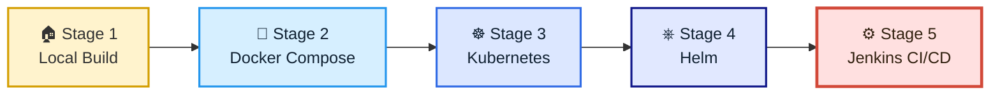

---

# 1️⃣ Stage 1: Traditional Local Deployment

## Architecture

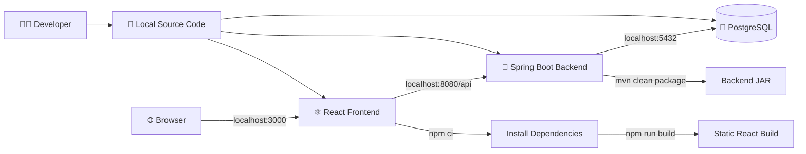

## Build and Run Flow

### Backend

```bash
cd user-service
mvn clean package
java -jar target/user-service-0.0.1-SNAPSHOT.jar
```

### Frontend

```bash
cd skillorbit-ui
npm ci
npm run build
npm start
```

### PostgreSQL

PostgreSQL runs directly on the host operating system. The backend connects using a localhost database URL.

## Characteristics

- Manual dependency installation
- Manual Maven and npm builds
- Host-level PostgreSQL management
- Application services tied to localhost ports
- Environment differences between developer systems
- No image packaging, orchestration, or automated rollout

## Limitations

- “Works on my machine” differences
- Manual startup order
- No workload isolation
- No automated recovery
- No deployment version traceability
- Difficult rollback and environment recreation

---

# 2️⃣ Stage 2: Dockerized Deployment with Docker Compose

## Architecture

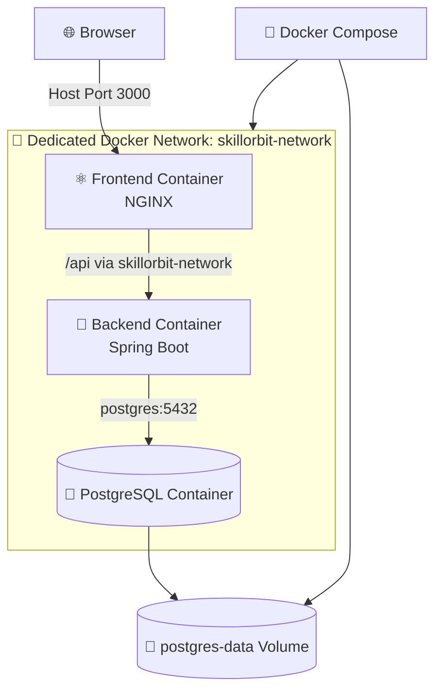

## Architectural Enhancements

### Containerization

- Frontend, backend, and PostgreSQL run as isolated containers.
- Docker images provide consistent runtime environments.
- Service names replace localhost for container-to-container communication.

### Dedicated Network

```text
skillorbit-network
```

The containers communicate through Docker DNS:

```text
frontend → backend:8080
backend → postgres:5432
```

### Persistent Volume

```text
postgres-data
```

The PostgreSQL data directory is mounted to a named volume so database data survives container recreation.

### Docker Compose Orchestration

Docker Compose defines:

- Services
- Container images and build contexts
- Ports
- Environment variables
- Networks
- Persistent volumes
- Startup dependencies

## Improvements over Local Deployment

- Reproducible application runtime
- Isolated service dependencies
- Service discovery using container names
- Persistent PostgreSQL storage
- One-command environment startup
- Easier onboarding and troubleshooting

## Remaining Limitations

- Single-host orchestration
- Limited self-healing
- No native autoscaling
- Manual image version management
- No rolling deployment strategy
- Limited production-grade secret handling

---

# 3️⃣ Stage 3: Kubernetes Container Orchestration with kind

## Architecture

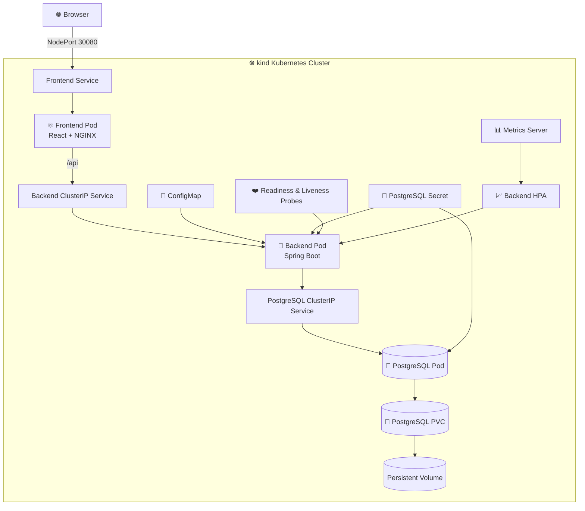

## Architectural Enhancements

### Kubernetes Workloads

- Deployments maintain desired replica counts.
- ReplicaSets manage Pod replacements.
- Pods become replaceable runtime units.
- Kubernetes restarts failed workloads automatically.

### Service Discovery

- Frontend accesses the backend through the backend Service.
- Backend accesses PostgreSQL through the PostgreSQL Service.
- Cluster DNS removes host-specific IP dependencies.

### Configuration and Secrets

- ConfigMap stores non-sensitive backend configuration.
- Kubernetes Secret stores PostgreSQL credentials.
- Configuration is separated from container images.

### Persistent Storage

- PostgreSQL uses a PersistentVolumeClaim.
- Database data remains available across Pod replacements and Helm upgrades.

### Health Management

- Readiness probes control when backend Pods receive traffic.
- Liveness probes restart unhealthy backend containers.
- Startup behavior is separated from ongoing health monitoring.

### Resource Management and Autoscaling

- CPU and memory requests reserve required capacity.
- Limits protect the node from excessive consumption.
- Metrics Server exposes Pod resource metrics.
- HPA scales the backend between 1 and 5 replicas at a 70% CPU target.

## Improvements over Docker Compose

- Self-healing workloads
- Declarative desired state
- Rolling updates
- Service discovery
- Health probes
- Resource governance
- Horizontal autoscaling
- Persistent storage abstraction

## Remaining Limitations

- Multiple Kubernetes YAML files require coordinated maintenance.
- Image versions are manually updated.
- Images initially require `kind load docker-image`.
- Release rollback requires manual coordination.

---

# 4️⃣ Stage 4: Helm-Based Kubernetes Packaging

## Architecture

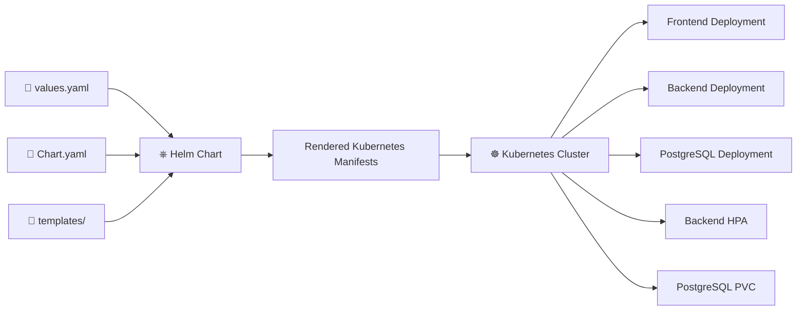

## Helm Package Structure

```text
skillorbit-helm/
├── Chart.yaml
├── values.yaml
└── templates/
    ├── backend-deployment.yaml
    ├── backend-service.yaml
    ├── backend-configmap.yaml
    ├── backend-hpa.yaml
    ├── frontend-deployment.yaml
    ├── frontend-service.yaml
    ├── postgres.yaml
    ├── postgres-service.yaml
    ├── postgres-pvc.yaml
    └── postgres-secrets.yaml
```

## Architectural Enhancements

### Values-Driven Configuration

`values.yaml` controls:

- Image repositories
- Image tags
- Pull policies
- Service types and ports
- HPA settings
- Resource settings
- PostgreSQL credentials and storage
- Registry pull Secret references

### Reusable Templates

The Deployment templates receive values instead of hardcoding environment-specific settings.

### Release Management

Helm adds:

- Installation and upgrades
- Release history
- Revision tracking
- Rollbacks
- Manifest rendering and validation
- Atomic upgrade support

### Simplified Deployment

```bash
helm upgrade --install skill-orbit ./skillorbit-helm
```

replaces manually applying multiple Kubernetes manifest files.

## Improvements over Raw Kubernetes YAML

- Centralized configuration
- Reusable deployment package
- Dynamic image value injection
- Release revision history
- Controlled rollback capability
- Easier promotion across environments

## Remaining Limitations

- Builds, scans, image pushes, and Helm upgrades remain manually triggered.
- Credentials and image tags require manual coordination.
- Deployment verification is not yet consistently automated.

---

# 5️⃣ Stage 5: Jenkins-Integrated Helm Deployment

## End-to-End CI/CD Architecture

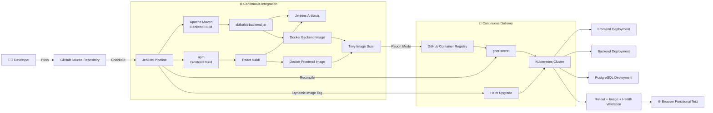

## Jenkins Pipeline Stages

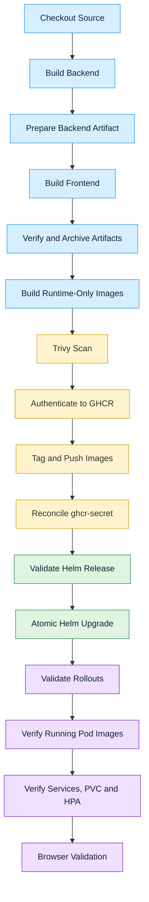

## CI Enhancements

### Automated Source Checkout

Jenkins checks out the `main` branch from GitHub and builds the exact commit stored in the Jenkins workspace.

### Artifact-Based Image Packaging

The Dockerfiles were refactored from source-building multi-stage images to runtime-only images:

```text
Jenkins Build
↓
Verified Artifact
↓
Runtime-Only Docker Image
```

This implements **Build Once, Deploy Many**.

### Immutable Image Versioning

```text
v1.3.0-build24
v1.3.0-build25
v1.3.0-build26
```

Each image tag maps the SkillOrbit release to the exact Jenkins build.

### Trivy Scanning

- Backend and frontend images are scanned before publication.
- Findings are currently reported without blocking the pipeline.
- The frontend runtime image is clean.
- The backend report identifies dependency remediation work for a future security sprint.

### Private GHCR Publishing

```text
ghcr.io/sshaikp/skillorbit-backend
ghcr.io/sshaikp/skillorbit-frontend
```

Jenkins authenticates using managed credentials, pushes immutable tags, and logs out after publication.

## CD Enhancements

### Kubernetes Registry Authentication

Jenkins reconciles a namespace-scoped Secret:

```text
ghcr-secret
```

Secret type:

```text
kubernetes.io/dockerconfigjson
```

The backend and frontend Pod templates reference the Secret through `imagePullSecrets` before kubelet pulls the private images.

### Dynamic Helm Tag Injection

Stable repositories remain in `values.yaml`, while Jenkins injects only the changing image tag:

```text
backend.image.tag=v1.3.0-build<BUILD_NUMBER>
frontend.image.tag=v1.3.0-build<BUILD_NUMBER>
```

### Atomic Helm Deployment

The pipeline uses:

```text
--wait
--timeout
--atomic
```

A failed upgrade restores the previous working Helm revision while Jenkins records the deployment failure.

### Deployment Validation

Jenkins validates:

- PostgreSQL rollout
- Backend rollout
- Frontend rollout
- Expected Deployment image tags
- Actual running Pod images
- Kubernetes Services
- PostgreSQL PVC
- Metrics Server
- Backend HPA
- Browser accessibility

---

# 🔁 Final Delivery Flow

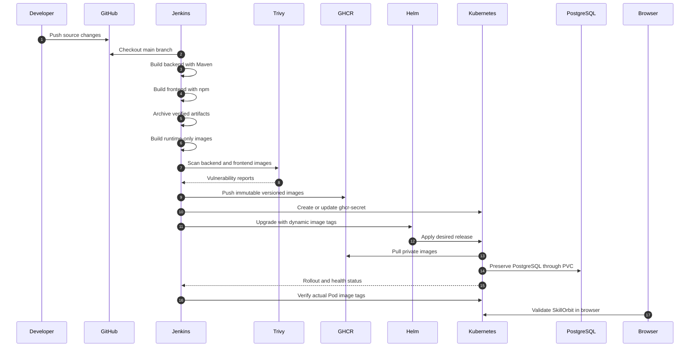

---

# 📊 Architecture Capability Matrix

| Capability | Local | Docker Compose | Kubernetes | Helm | Jenkins CI/CD |
|---|---:|---:|---:|---:|---:|
| Reproducible runtime | ❌ | ✅ | ✅ | ✅ | ✅ |
| Dedicated network/service discovery | ❌ | ✅ | ✅ | ✅ | ✅ |
| Persistent PostgreSQL storage | Host managed | ✅ | ✅ | ✅ | ✅ |
| Self-healing workloads | ❌ | Limited | ✅ | ✅ | ✅ |
| Health probes | ❌ | Limited | ✅ | ✅ | ✅ |
| Resource requests and limits | ❌ | Limited | ✅ | ✅ | ✅ |
| Horizontal autoscaling | ❌ | ❌ | ✅ | ✅ | ✅ |
| Package-based deployment | ❌ | ❌ | ❌ | ✅ | ✅ |
| Immutable image tags | Manual | Manual | Manual | Supported | ✅ Automated |
| Vulnerability scanning | ❌ | ❌ | ❌ | ❌ | ✅ Trivy |
| Private registry publishing | ❌ | Optional | Optional | Supported | ✅ GHCR |
| Automated deployment | ❌ | Partial | Partial | Partial | ✅ |
| Automatic rollback | ❌ | ❌ | Kubernetes only | ✅ Helm | ✅ Atomic Helm |
| Post-deployment validation | Manual | Manual | Manual | Manual | ✅ Automated |

---

# 🔐 Security Architecture

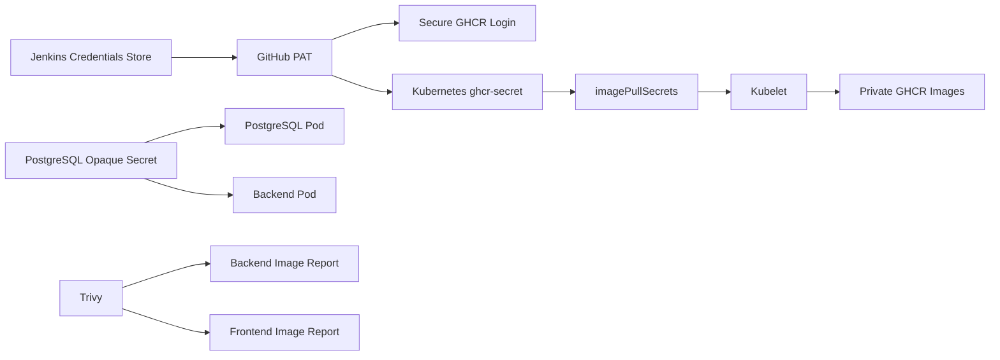

Security principles:

- No GitHub PAT stored in Git
- No registry credentials stored in Helm values
- Credentials injected only within Jenkins credential scope
- Kubernetes registry Secret reconciled idempotently
- PostgreSQL credentials separated from registry credentials
- Runtime images scanned before publication
- Immutable image tags support traceability and rollback
- Least-privilege improvements remain part of the security backlog

---

# 💾 Data Persistence Architecture

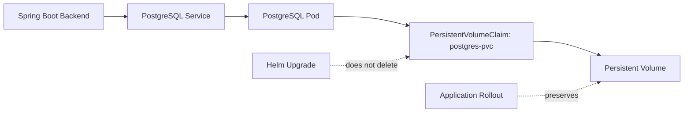

The database workload remains independent from frontend and backend image releases. Helm upgrades replace application Pods while the bound PostgreSQL volume preserves database state.

---

# 📈 Scalability and Health Architecture

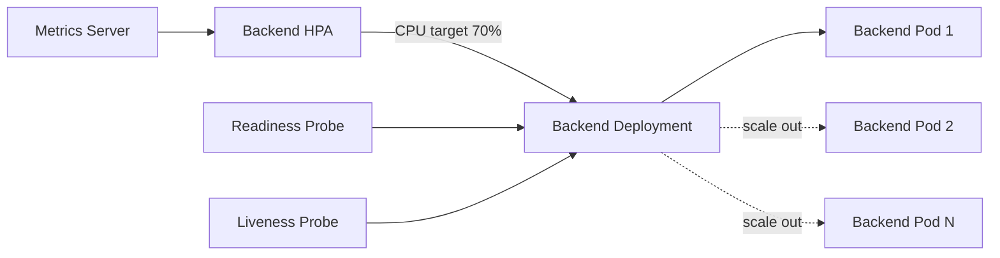

Current HPA configuration:

```text
Minimum replicas: 1
Maximum replicas: 5
Target CPU utilization: 70%
```

Validated runtime metric:

```text
cpu: 1%/70%
```

---

# 🧭 Release Evolution

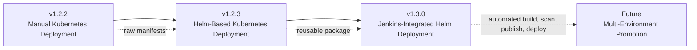

## Current Release

```text
v1.3.0-JenkinsIntegratedHelmDeployment
```

## Current Delivery Model

```text
GitHub → Jenkins → Maven/npm → Docker → Trivy → GHCR → Helm → Kubernetes → Validation
```

---

# 🔮 Planned Enhancements

- Dev, staging, and production namespaces
- Environment-specific Helm values files
- Automated promotion between environments
- Enforced Trivy quality gates
- Spring Boot dependency remediation
- Database schema migrations using Flyway or Liquibase
- Automated API and browser smoke testing
- Jenkinsfile stored and versioned in Git
- Dedicated Jenkins agents
- External secret management using Vault or a cloud secrets manager
- Terraform-based cloud infrastructure provisioning
- Cloud monitoring, centralized logging, and alerting
- Ingress, TLS, and DNS-based application access

---

# 📝 Architecture Decision Summary

1. **Local build** established application functionality.
2. **Docker Compose** introduced container isolation, a dedicated network, and persistent PostgreSQL storage.
3. **Kubernetes on kind** introduced orchestration, self-healing, service discovery, probes, resources, HPA, and PVC-based persistence.
4. **Helm** converted multiple manifests into a configurable, versioned release package.
5. **Jenkins** automated source checkout, builds, artifact handling, image packaging, scanning, registry publishing, Helm deployment, rollback safety, and runtime validation.
6. **GHCR** became the source of truth for immutable backend and frontend images.
7. **Kubernetes imagePullSecrets** enabled secure access to private registry images.
8. **Post-deployment verification** ensured that pipeline success represents actual application success.

---

<p align="center">
  <strong>🚀 SkillOrbit: From Local Build to Automated Cloud-Native Delivery</strong>
</p>

<p align="center">
  &nbsp;
  &nbsp;
  &nbsp;
  &nbsp;
  
</p>

---

## 📚 Diagram and Icon Notes

- GitHub supports Mermaid diagrams directly inside Markdown files.
- Brand icons are loaded from the Simple Icons CDN.
- Mermaid diagrams remain text-based and version controlled, making architecture updates easy to review alongside code changes.
