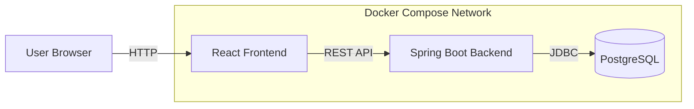

# 🐳 SkillOrbit Containerization

## Overview

This folder documents **Phase 2** of the SkillOrbit deployment journey: migrating the React frontend, Spring Boot backend, and PostgreSQL database into independently managed containers orchestrated with Docker Compose.

## Architecture



## Services

| Service | Responsibility |
|---|---|
| Frontend | Serves the React application and sends API requests |
| Backend | Exposes REST APIs and implements application logic |
| PostgreSQL | Stores persistent application data |

## Objectives

- Eliminate host-specific dependency differences
- Package each application tier independently
- Provide service discovery through Docker networking
- Preserve PostgreSQL data with a named volume
- Start the complete stack through Docker Compose
- Create a portable foundation for AWS and Kubernetes deployments

## Documentation

1. [Container architecture](./01-container-architecture.md)
2. [Docker images](./02-docker-images.md)
3. [Docker Compose deployment](./03-docker-compose-deployment.md)
4. [Networking and configuration](./04-networking-and-configuration.md)
5. [Troubleshooting](./05-troubleshooting.md)

## Quick Start

Run these commands from the directory containing the Compose file:

```bash
docker compose up --build -d
docker compose ps
docker compose logs -f
```

Stop the stack while retaining persistent volumes:

```bash
docker compose down
```

Remove the stack and its volumes:

```bash
docker compose down -v
```

> **Warning:** `docker compose down -v` deletes PostgreSQL data stored in the Compose-managed volume.

## Deployment Evolution

1. Traditional local deployment
2. Docker Compose containerization
3. AWS deployment
4. Kubernetes deployment
5. Helm packaging and CI/CD automation
