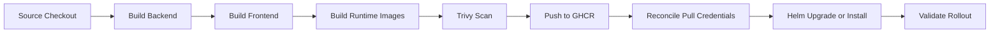

# Milestone 6: Jenkins CI/CD Automation

## Goal

Automate the complete path from source code to a validated Helm-managed Kubernetes release.

## Final Pipeline

## Implementation Summary

- Jenkins checks out the source
- Maven builds and tests the Spring Boot artifact
- npm builds the React production assets
- Runtime Docker images consume the prebuilt artifacts
- Trivy scans the images
- Versioned images are pushed to GitHub Container Registry
- Kubernetes registry credentials are reconciled
- Helm receives the intended image versions
- Kubernetes rollout status is validated

## Engineering Decision: Build Once

The pipeline compiles frontend and backend artifacts once. Runtime images package those outputs instead of rebuilding source inside Docker. This keeps compilation, image packaging, and deployment as distinct stages and makes failures easier to locate.

## Image and Release Traceability

A deployment should identify the exact image versions released. Mutable-only tagging weakens rollback and investigation, so the pipeline should retain a traceable version or commit-based tag.

## Security Controls

- Registry credentials remain in the CI/CD credential store
- Kubernetes pull credentials are created or updated without exposing token values
- Trivy scanning runs before release promotion
- Logs must not print credentials or complete secret objects

## Failure Handling

The pipeline must fail when:

- Backend or frontend builds fail
- Image creation fails
- Required image scanning fails according to the configured policy
- Registry publishing fails
- Helm deployment fails
- Kubernetes rollout validation fails

A failed rollout must not be reported as a successful deployment merely because image publishing or Helm invocation completed.

## End-to-End Validation

- Pipeline-built artifacts are present in runtime images
- Published tags match Helm values
- Cluster image pull succeeds
- Pods become Ready
- Services route application traffic
- Authentication and core user flows work
- Helm shows the expected release revision
- Jenkins records a clear final result

## Resulting Release

This milestone is represented by release `v1.3.0`, the Jenkins-integrated CI/CD deployment.

## Outcome

SkillOrbit reached an automated delivery model covering build, test, image packaging, vulnerability scanning, registry publishing, Helm release management, and Kubernetes rollout validation.

## Related Documentation

- `Jenkinsfile`
- Runtime Dockerfiles
- Helm chart and values files
- CI/CD and release notes in the repository

## Documentation Boundary

This journal records engineering decisions, failures, investigations, and lessons. Current commands and operational procedures belong in `docs/Technical-Documentation`, `docs/Containerization`, and `docs/Deployment-Strategies`.
