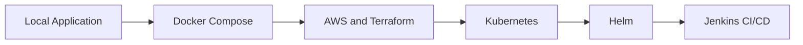

# SkillOrbit Engineering Journal

## Purpose

This journal records the decisions, implementation milestones, failures, investigations, and lessons that evolved SkillOrbit from a local application into a Jenkins-automated, Helm-managed Kubernetes deployment.

It is historical engineering context, not the primary setup guide. Follow the current technical, containerization, and deployment documentation for operational instructions.

## Engineering Journey



## Milestones

1. [Application foundation](./01-application-foundation.md)
2. [Docker Compose evolution](./02-docker-compose-evolution.md)
3. [AWS and Terraform evolution](./03-aws-terraform-evolution.md)
4. [Kubernetes evolution](./04-kubernetes-evolution.md)
5. [Helm release management](./05-helm-release-management.md)
6. [Jenkins CI/CD automation](./06-jenkins-cicd-automation.md)

## Release Markers

| Release | Milestone |
|---|---|
| `v1.2.2` | Manual Kubernetes deployment |
| `v1.2.3` | Helm-managed Kubernetes deployment |
| `v1.3.0` | Jenkins-integrated CI/CD deployment |

## Final Delivery Flow

```text
Source checkout
    -> backend and frontend builds
    -> runtime image packaging
    -> Trivy image scanning
    -> GHCR image publishing
    -> registry credential reconciliation
    -> Helm upgrade/install
    -> Kubernetes rollout validation
```

## Historical Daily Notes

Original `day-*.md` files should be retained unchanged under `archive/` only when they contain unique investigation history. Archived notes may contain superseded commands and must not be used as current deployment instructions.

## Documentation Ownership

- `docs/Technical-Documentation`: setup, API behavior, and engineering plan
- `docs/Containerization`: Docker images, Compose, networking, and troubleshooting
- `docs/Deployment-Strategies`: deployment models and validation
- This folder: decisions, incidents, root causes, and lessons
- Git tags and release notes: version-specific changes
