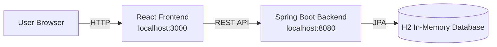
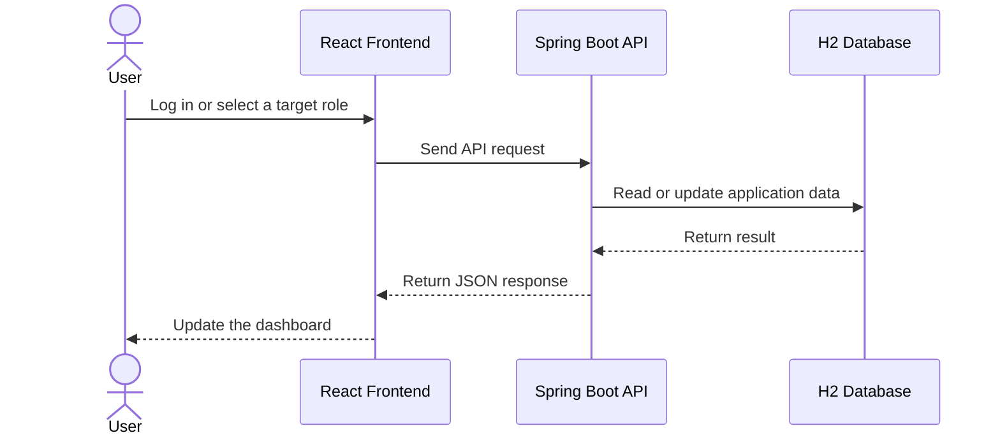
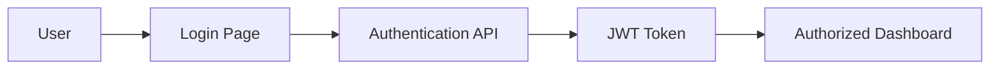
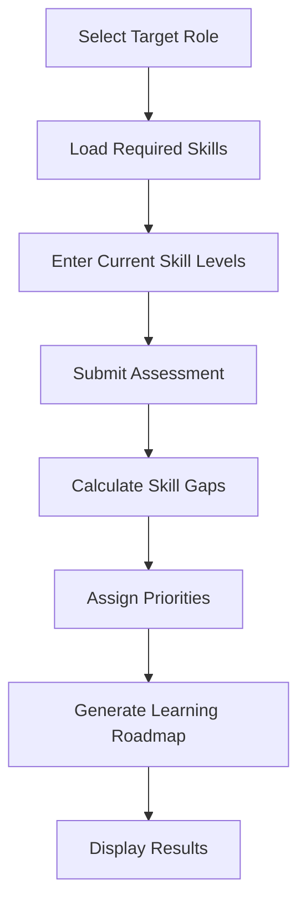

# 🚀 Phase 1: Traditional Local Deployment

## Overview

This phase establishes the first working deployment of SkillOrbit before containerization and cloud-native orchestration.

All application components run directly on the developer host:

- React frontend
- Spring Boot backend
- H2 in-memory database

The purpose of this phase is to validate the application architecture and core business flows before introducing infrastructure abstraction.

## Objectives

- Build and validate the minimum viable application
- Confirm frontend-to-backend communication
- Implement JWT-based authentication
- Enforce role-based access control
- Validate role and skill management
- Implement skill-gap analysis
- Generate personalized learning roadmaps
- Establish a baseline for later deployment phases

## Architecture



## Component Responsibilities

### React Frontend

The frontend provides:

- Login and registration interfaces
- Administrator dashboard
- User dashboard
- Role and skill selection
- Skill self-assessment
- Analysis results and learning recommendations
- REST API consumption

### Spring Boot Backend

The backend provides:

- Authentication and authorization
- JWT creation and validation
- User, role, and skill management
- Skill-gap calculation
- Learning-roadmap generation
- Persistence through Spring Data JPA

### H2 Database

The H2 database stores the application data required for local validation, including users, roles, skills, assessments, and roadmap definitions.

Because this phase uses an in-memory database, stored data is not intended to survive every application restart.

## Prerequisites

- Java 17 or later
- Maven 3.9 or later, or the included Maven wrapper
- Node.js
- npm

## Start the Backend

```bash
cd user-service
./mvnw spring-boot:run
```

If the Maven wrapper is unavailable:

```bash
cd user-service
mvn spring-boot:run
```

The backend is available at:

```text
http://localhost:8080
```

## Start the Frontend

Open a second terminal:

```bash
cd skillorbit-ui
npm install
npm start
```

The frontend is available at:

```text
http://localhost:3000
```

## Request Flow



## Authentication Flow



The client sends the JWT with protected API requests. The backend validates the token and applies role-based authorization before allowing access to secured operations.

## Skill Analysis Flow



## Validation Checklist

- Frontend loads at `localhost:3000`
- Backend starts at `localhost:8080`
- Frontend can call the backend APIs
- Authentication returns a valid JWT
- Protected endpoints reject unauthorized requests
- Admin and user permissions remain separated
- Role and skill data can be managed
- Skill-gap analysis returns the expected result
- Learning recommendations are displayed in the UI

## Challenges and Resolutions

### API Communication

**Challenge:** Frontend and backend communication failed when API paths or client configuration did not match the backend routes.

**Resolution:** Standardize endpoint paths, correct the client request configuration, and validate JSON response handling.

### JWT Authorization

**Challenge:** Protected requests required consistent token propagation and backend authorization handling.

**Resolution:** Apply JWT filtering, configure Spring Security, and protect administrator operations with role-based authorization.

### Data Relationships

**Challenge:** Roles, skills, assessments, and roadmap definitions required consistent entity relationships.

**Resolution:** Define explicit JPA relationships and keep the application data model aligned with the business flow.

## Outcome

This phase delivers a functional local baseline with authentication, authorization, administrative workflows, skill-gap analysis, and learning-roadmap generation.

Its main limitation is environment dependency: the frontend, backend, toolchain, and database all rely on the host configuration. Phase 2 addresses this by packaging the application components into containers.

## Next Phase

Continue to [Phase 2: Containerized Deployment](./02-containerized-deployment.md).
