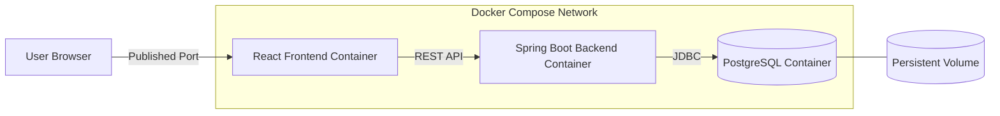

# 🐳 Phase 2: Containerized Deployment

## Overview

This phase packages SkillOrbit as a multi-container application managed by Docker Compose.

The deployment replaces host-installed application runtimes with isolated services:

- React frontend container
- Spring Boot backend container
- PostgreSQL database container

Docker Compose provides a repeatable way to build, start, network, and stop the complete stack.

## Objectives

- Package the frontend and backend as independent images
- Replace the H2 development database with PostgreSQL
- Isolate service dependencies
- Provide service discovery through Docker networking
- Externalize runtime configuration
- Persist database data independently of container lifecycle
- Create a portable baseline for cloud and Kubernetes deployment

## Architecture



## Service Responsibilities

### Frontend Container

- Serves the compiled React application
- Provides the browser-facing user interface
- Sends API requests to a browser-reachable backend address or configured proxy

### Backend Container

- Runs the packaged Spring Boot application
- Exposes the SkillOrbit REST APIs
- Validates JWTs and applies role-based authorization
- Connects to PostgreSQL through the Compose network

### PostgreSQL Container

- Stores persistent application data
- Uses a Docker-managed volume
- Exposes database connectivity to the backend service

## Prerequisites

- Docker Engine or Docker Desktop
- Docker Compose v2

Verify the installation:

```bash
docker version
docker compose version
```

## Start the Stack

Run the following command from the directory containing `docker-compose.yml`:

```bash
docker compose up --build -d
```

Check service status:

```bash
docker compose ps
```

Follow application logs:

```bash
docker compose logs -f
```

## Stop the Stack

Stop and remove the containers and Compose network while retaining named volumes:

```bash
docker compose down
```

Remove containers, the network, and named volumes:

```bash
docker compose down -v
```

> **Warning:** Removing the volume deletes the PostgreSQL data managed by this Compose project.

## Networking Model

Docker Compose places the services on an isolated application network. Containers communicate using Compose service names and container ports.

Inside the backend container, `localhost` refers to the backend container itself. The PostgreSQL connection must therefore use the database service name defined in the Compose file.

Browser-side React code follows a different path. It runs in the user's browser, so it must call an address that is reachable from the host environment. An internal Compose service name is not automatically resolvable by the browser.

## Runtime Configuration

Environment-specific settings should be supplied outside the images. Typical settings include:

- PostgreSQL database name
- PostgreSQL username and password
- Spring datasource URL
- Frontend API address
- Allowed CORS origins
- Active Spring profile

Do not commit real credentials. Keep the local environment file out of version control and maintain a sanitized example containing only the required variable names.

## Health and Dependency Handling

A started database container is not necessarily ready for application connections. The database health check should validate the configured database and user.

Service dependency ordering can control startup order, but application logs and health checks must still be used to verify readiness.

## Validation Checklist

- All services are listed by `docker compose ps`
- PostgreSQL reaches the configured health state
- Backend starts without datasource errors
- Frontend loads through its published port
- Browser API requests reach the backend
- Login and authorization work correctly
- Application data survives a normal container recreation

## Troubleshooting

### Backend Cannot Reach PostgreSQL

Check that:

- PostgreSQL is running
- The datasource uses the database service name instead of `localhost`
- Database credentials match
- Both services are attached to the same network
- The backend uses the database container port

### Browser Reports a CORS Error

Compare the actual frontend origin with the backend's allowed origins. The protocol, hostname, and port must match the intended configuration.

### Frontend Calls an Internal Service Name

Configure a host-reachable backend address or proxy API requests through the frontend web server.

### Stale Build or Data

Rebuild images without cache when required:

```bash
docker compose down
docker compose build --no-cache
docker compose up -d
```

Delete volumes only when losing the database data is acceptable.

## Outcome

This phase produces a reproducible multi-container deployment and removes most host-runtime dependencies. It also introduces operational concerns that carry forward into later phases: immutable images, external configuration, service readiness, networking, persistence, and secure secret handling.

## Next Phase

Continue to [Phase 3: AWS Cloud Deployment](./03-cloud-deployment.md).
