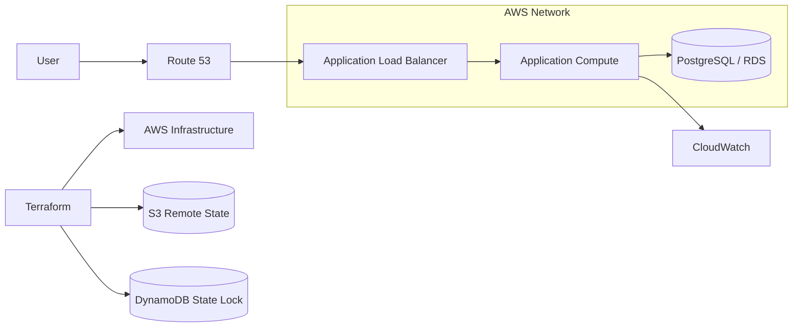

# ☁️ Phase 3: AWS Cloud Deployment

## Overview

This phase moves SkillOrbit from a local containerized environment to AWS infrastructure.

The goal is to separate infrastructure provisioning from application deployment while preserving the same three-tier application model:

- React frontend
- Spring Boot backend
- PostgreSQL database

Terraform is used to define and manage AWS infrastructure. Remote state is stored in Amazon S3, with DynamoDB locking used to protect state operations from concurrent changes.

## Objectives

- Provision AWS infrastructure through Terraform
- Organize infrastructure as reusable modules
- Separate environment-specific configuration
- Manage Terraform state remotely
- Protect state changes with locking
- Deploy the application into a cloud-hosted environment
- Introduce AWS networking, security, monitoring, and recovery practices
- Maintain a safe teardown process

## Deployment Model



> The diagram represents the deployment responsibilities documented for this phase. The repository's Terraform configuration remains the source of truth for the exact resources and topology.

## Infrastructure as Code

Terraform configuration should remain modular and environment-aware.

The SkillOrbit infrastructure model uses:

- Reusable Terraform modules
- S3 remote state
- DynamoDB state locking
- Cross-stack state references
- `for_each` patterns where repeated resources are required
- Git-tagged module versions

## State Management

Terraform state records the mapping between configuration and provisioned infrastructure. Losing, corrupting, or concurrently modifying state can make infrastructure changes unsafe.

The remote-state design separates state from the local workstation:

```text
Terraform client
      |
      +--> S3 bucket: state storage
      |
      +--> DynamoDB table: state lock
```

### State Safety Rules

- Do not commit local state files
- Do not manually edit state files
- Use locking for shared state operations
- Review the plan before applying changes
- Keep backend resources available until dependent stacks are destroyed
- Back up or version state according to the environment's recovery requirements

## Recommended Infrastructure Workflow

Initialize the configured backend:

```bash
terraform init
```

Format and validate configuration:

```bash
terraform fmt -check
terraform validate
```

Review the proposed change:

```bash
terraform plan
```

Apply an approved plan:

```bash
terraform apply
```

Inspect managed resources:

```bash
terraform state list
```

## Configuration and Secrets

Do not embed credentials or environment-specific values in application images or Terraform source files.

Use environment-appropriate mechanisms for:

- AWS credentials
- Database credentials
- Application secrets
- Image registry authentication
- Environment-specific hostnames
- Runtime feature configuration

Commit example variable files only when they contain placeholders rather than real secrets.

## Validation Checklist

- Terraform initialization succeeds against the remote backend
- Formatting and validation complete successfully
- The plan contains only expected changes
- State is written to the configured S3 backend
- Concurrent state changes are prevented by locking
- Networking rules allow only required traffic
- Application compute can reach the database
- User-facing endpoints are reachable as designed
- Monitoring receives infrastructure and application signals
- Resource ownership and environment tags are present where configured

## Teardown and Recovery Lessons

Cloud teardown must follow dependency order. A versioned S3 bucket may retain noncurrent object versions even after current objects are removed. Those retained versions can prevent bucket deletion.

Destroying state-backend resources before dependent infrastructure can also prevent Terraform from releasing or updating the state lock.

Use these controls:

1. Review dependencies before destruction
2. Destroy application stacks before their shared backend
3. Check versioned buckets for current and noncurrent objects
4. Confirm that state locks are released
5. Verify that no unintended resources remain
6. Check the AWS account for residual cost-generating resources

Manual remediation should be documented and followed by state and infrastructure validation.

## Outcome

This phase demonstrates repeatable AWS provisioning, remote-state governance, modular infrastructure design, and cloud teardown discipline. It also exposes the operational limits of managing application instances directly, which motivates the transition to an orchestrated deployment model.

## Next Phase

Continue to [Phase 4: Kubernetes-Orchestrated Deployment](./04-orchestrated-cloud-deployment.md).
