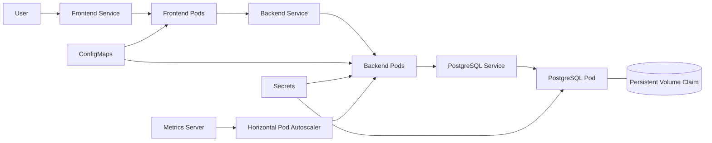
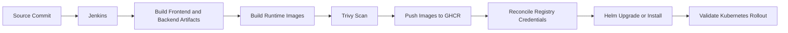

# ☸️ Phase 4: Kubernetes-Orchestrated Deployment

## Overview

This phase deploys SkillOrbit to Kubernetes and evolves the application from individually managed containers into declarative, orchestrated workloads.

The implementation uses a local `kind` cluster for Kubernetes practice and validation. The application is packaged with Helm and later integrated with a Jenkins delivery pipeline.

## Objectives

- Deploy the frontend, backend, and PostgreSQL workloads to Kubernetes
- Define desired state through declarative manifests
- Separate configuration from container images
- Add startup, readiness, and liveness validation
- Set CPU and memory requests and limits
- Observe resource usage through Metrics Server
- Configure Horizontal Pod Autoscaling
- Package the release as a Helm chart
- Automate build, scan, publish, deploy, and rollout validation through Jenkins

## Architecture



## Kubernetes Resources

### Deployments

Deployments define the desired state for stateless application workloads and support controlled pod replacement and rollout tracking.

### Services

Services provide stable networking for frontend, backend, and database workloads even when individual pods are recreated.

### ConfigMaps and Secrets

ConfigMaps hold non-sensitive runtime configuration. Secrets hold sensitive values required by the workloads.

Neither should be treated as a substitute for appropriate external secret protection in a shared or production environment.

### Persistent Storage

PostgreSQL requires storage that survives pod replacement. The workload therefore uses persistent storage through Kubernetes volume resources.

## Health Probes

Health probes let Kubernetes make different decisions about a container:

- **Startup probe:** determines whether application initialization has completed
- **Readiness probe:** determines whether the pod should receive traffic
- **Liveness probe:** determines whether the container should be restarted

Probe paths, ports, delays, periods, and thresholds must reflect actual application startup and health behavior.

## Resource Management

Requests influence scheduling. Limits constrain the maximum CPU or memory that a container can consume.

```yaml
resources:
  requests:
    cpu: <request>
    memory: <request>
  limits:
    cpu: <limit>
    memory: <limit>
```

Values must be derived from observed workload behavior rather than copied blindly between services.

## Metrics and Autoscaling

Metrics Server supplies resource metrics used by commands such as:

```bash
kubectl top pods
kubectl top nodes
```

Horizontal Pod Autoscaler adjusts replica count according to the configured target metrics and scaling policy.

Validate HPA behavior with:

```bash
kubectl get hpa
kubectl describe hpa <hpa-name>
```

## Helm Packaging

Helm packages the Kubernetes resources into reusable templates. Environment-specific values are supplied through the chart's values rather than hardcoded repeatedly across manifests.

Typical release operations include:

```bash
helm lint <chart-path>
helm template <release-name> <chart-path>
helm upgrade --install <release-name> <chart-path>
helm status <release-name>
```

The chart is the deployment unit for the Helm-based SkillOrbit release.

## CI/CD Flow



The optimized pipeline compiles the Spring Boot JAR and React assets once. Runtime images consume the prebuilt artifacts instead of recompiling source during image creation.

## Deployment Validation

Check workload state:

```bash
kubectl get pods
kubectl get deployments
kubectl get services
kubectl get configmaps
kubectl get secrets
kubectl get hpa
```

Inspect rollout status:

```bash
kubectl rollout status deployment/<deployment-name>
```

Inspect a failing pod:

```bash
kubectl describe pod <pod-name>
kubectl logs <pod-name>
kubectl logs <pod-name> --previous
```

Validate Helm state:

```bash
helm list
helm status <release-name>
```

## Common Failure Modes

### `ImagePullBackOff`

Check the image name, tag, registry availability, and image pull credentials.

### `CrashLoopBackOff`

Inspect current and previous logs, environment configuration, dependency availability, command arguments, and probe behavior.

### `OOMKilled`

Compare memory usage with configured requests and limits. Confirm whether the application requires tuning or whether the limit is unrealistically low.

### Readiness Probe Failure

Verify that the path, port, response status, and initial delay match the real application behavior.

### HPA Shows Missing Metrics

Confirm that Metrics Server is healthy, pod resource requests are present, and the target workload exposes the required resource metrics.

## Rollback

Kubernetes and Helm retain rollout or release history that can support recovery when a deployment fails validation.

Inspect history before selecting a rollback target:

```bash
kubectl rollout history deployment/<deployment-name>
helm history <release-name>
```

Use the rollback mechanism that matches the deployment method used for the release.

## Outcome

This phase establishes declarative deployment, self-healing workload management, health-based traffic routing, controlled resource usage, autoscaling, Helm-based release packaging, image security scanning, and Jenkins-driven deployment automation.

The deployment progression is now:

```text
Traditional local deployment
        ↓
Docker Compose deployment
        ↓
AWS infrastructure deployment
        ↓
Kubernetes and Helm deployment
        ↓
Jenkins-driven CI/CD
```
