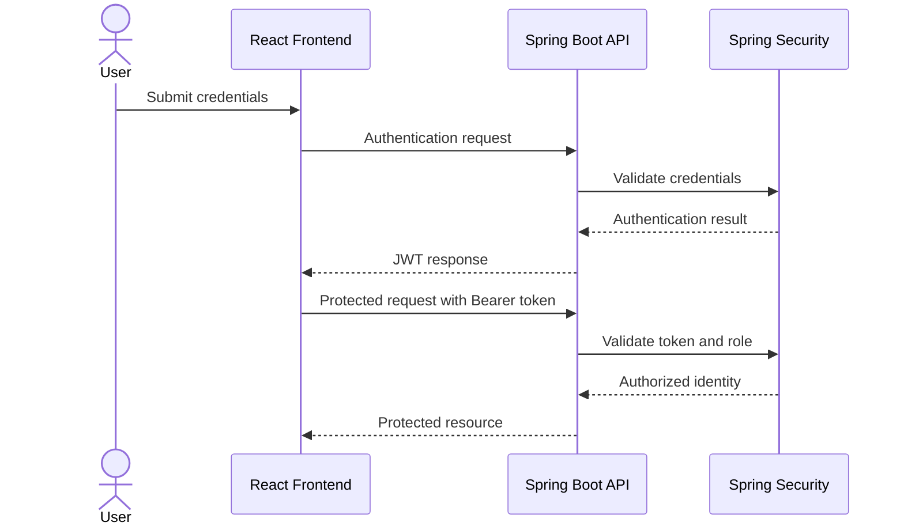
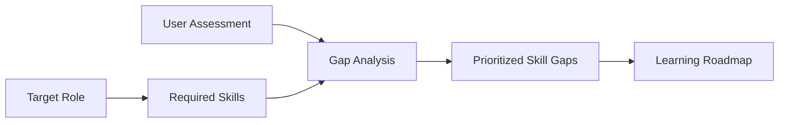

# 📘 SkillOrbit API Documentation

## Overview

SkillOrbit exposes REST APIs through a Spring Boot backend. The React frontend consumes these APIs to support authentication, administration, role selection, skill assessment, skill-gap analysis, and personalized learning-roadmap generation.

This document describes the API domains, security model, request conventions, and validation approach. The controller mappings in `user-service` remain the source of truth for exact paths, HTTP methods, and payload fields.

## Base Address

For the traditional local deployment, the backend runs at:

```text
http://localhost:8080
```

For Docker, AWS, and Kubernetes deployments, use the backend address exposed by that environment.

## Content Type

Unless an endpoint explicitly behaves differently, clients should exchange JSON:

```http
Content-Type: application/json
Accept: application/json
```

## Authentication Model

SkillOrbit uses JWT-based authentication with role-based access control.



Protected requests should send the token in the authorization header:

```http
Authorization: Bearer <jwt-token>
```

Never commit real tokens, passwords, or captured authorization headers to the repository.

## API Domains

### Authentication

Authentication operations support user access to SkillOrbit.

Typical responsibilities include:

- User registration
- User login
- Credential validation
- JWT generation
- JWT validation for protected requests

### User Administration

Administrative user operations support management of application users and their assigned access.

Access to administrative operations must be restricted by the backend security configuration rather than relying only on hidden frontend controls.

### Role Management

Role operations support:

- Creating target career roles
- Retrieving available roles
- Updating role details
- Removing roles where allowed
- Associating required skills with a role

### Skill Management

Skill operations support:

- Creating skills
- Retrieving the skill catalog
- Updating skill definitions
- Removing skills where allowed
- Linking skills to target roles

### Assessment

Assessment operations support submission or retrieval of a user's current proficiency levels for skills associated with a selected role.

### Skill-Gap Analysis

The analysis workflow compares user proficiency with target-role requirements and calculates the gaps that should be prioritized.



### Learning Roadmaps

Roadmap operations return learning recommendations based on the calculated gaps and configured learning-path information.

## Request Lifecycle

A protected request follows this sequence:

1. The client authenticates and receives a JWT.
2. The client includes the token in the authorization header.
3. Spring Security validates the token.
4. Role-based rules authorize or reject the operation.
5. The controller validates the request payload.
6. The service applies business logic.
7. The persistence layer reads or updates data.
8. The API returns a JSON response or an error.

## Response and Error Conventions

API responses should use HTTP status codes consistently.

| Status | Meaning |
|---|---|
| `200 OK` | Request completed successfully |
| `201 Created` | A resource was created |
| `204 No Content` | Request completed without a response body |
| `400 Bad Request` | Input was invalid |
| `401 Unauthorized` | Authentication was missing or invalid |
| `403 Forbidden` | The authenticated identity lacked permission |
| `404 Not Found` | The requested resource was not found |
| `409 Conflict` | The request conflicted with existing data |
| `500 Internal Server Error` | An unexpected server-side failure occurred |

The implemented exception handlers and controllers determine the exact response body.

## Validation Checklist

For every API change, validate:

- The route and HTTP method match the controller mapping
- Required fields are validated
- Sensitive endpoints require authentication
- Administrative endpoints enforce the expected role
- Invalid tokens return an authentication error
- Unauthorized roles return an authorization error
- Successful responses use the expected status and schema
- Invalid input produces a controlled client error
- Server logs do not expose secrets or credentials
- Frontend requests match the deployed backend address and CORS policy

## Testing Examples

Check backend availability using a repository-supported health endpoint when one is configured.

Test a public operation with `curl`:

```bash
curl -i   -H 'Accept: application/json'   '<backend-url>/<public-route>'
```

Test a protected operation:

```bash
curl -i   -H 'Accept: application/json'   -H 'Authorization: Bearer <jwt-token>'   '<backend-url>/<protected-route>'
```

Replace placeholders with mappings taken directly from the current Spring Boot controllers.

## Maintenance Rule

Update this document whenever a controller mapping, security rule, request schema, response schema, or API-facing environment setting changes. Do not document an endpoint until it exists in the repository.
